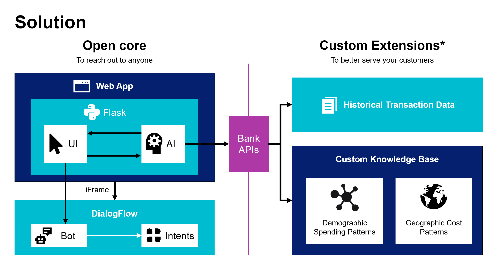

# Background
Lee, an online personal counselor, helps employees who struggle with feelings of mild anxiety or loneliness while working from home. Rather than cope alone, they talk with Lee to destress.

“You’re lonely?” Lee might say. “I’m sorry about that. Can you tell me more about how you’re feeling?”

We realized that some remote employees, many of whom were working at home for the first time as a result of recent physical distancing and stay-at-home guidelines, might be suffering from anxiety and mild stress. To help, we came up with the idea of creating a mental-health counseling chatbot.

## The Problem
This project falls under the theme of financial confidence and education. The global pandemic has affected us all. Feelings of isolation, depression and anxiety are on the rise. The spread of COVID-19 has caused a global economic recession. We can help you be there for customers struggling with these issues.

## The Solution
Our solution is to build an artificial intelligence that listens and makes helpful suggestions. The interactive AI is trained on techniques that have been demonstrated effective at lowering stress and anxiety. The AI establishes a connection and gets permission from customers to make personalized suggestions. We use a linear optimizer to find creative suggestions for reaching personal goals with minimum hardship. Customers can improve the intelligence by connecting to their transaction history and to special-purpose knowledge bases.

We’ve designed the software as custom extensions to an open core. The core of the software is a Python/Flask application connected to a DialogFlow chatbot. This is all opensource and it can be used to engage both current and prospective customers. 

Custom extensions can be built from the third-party APIs. Historical transaction data, and custom knowledgebase data are used to make the AI even more personal and useful.

## The Impact
This solution is one of the best ways to use a digital channel to show customers care and concern without marketing to them. It provides a unique balance of open access and personal relevance.

